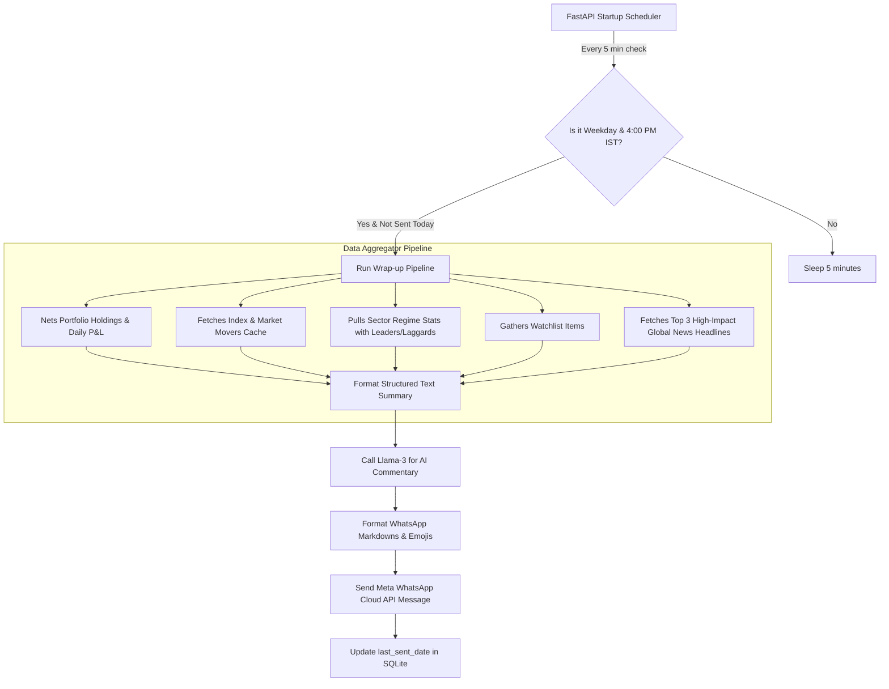

# WhatsApp Daily Market Close Wrap-Up Summary Implementation Plan

This document outlines the design, scheduling, and implementation details for the daily market wrap-up summary sent to the user's WhatsApp shortly after the Indian market close (4:00 PM IST). 

The summary aggregates index standings, portfolio daily changes, sector relative strength (with leaders and laggards), watchlist highlights, global market news headlines, and a concise AI-generated commentary.

---

## 🏗️ System Flow & Architecture

The daily wrap-up system consists of four main parts:
1. **Configurable Settings in SQLite** to toggle the scheduler, adjust the trigger time, and set the AI persona.
2. **An Aggregator Engine** that pulls index performance, nets active portfolio holdings, gathers sector data, parses market movers, scrapes watchlist tickers, pulls top global news headlines, and feeds a summary to the LLM for market commentary.
3. **An Asynchronous Background Loop** running in FastAPI that sweeps every 5 minutes to check if it's time to send today's summary.
4. **An Interactive UI Card** in the alerts tab allowing the user to configure settings, view execution logs, and trigger an on-demand wrap-up with a live preview.



---

## 📱 WhatsApp Styling & Formatting Rules

Since WhatsApp does not support HTML/CSS, the layout is styled strictly using WhatsApp's markdown rules:
1. **Consistent Color Coding**:
   - `🟢` / `🔺` for positive returns / gains.
   - `🔴` / `🔻` for negative returns / losses.
   - `🟡` or `⚪` for flat/neutral states.
2. **Visual Section Delimiters**:
   - Separate sections using bold double lines `════════════════════` or dotted dividers `────────────────────` to simulate card boundaries.
3. **Monospaced Numerical Columns**:
   - Wrap prices and change percentages in monospace blocks (e.g. ` ```24,123.85 (+0.45%)``` `) to force consistent character spacing, preventing wrap alignment issues on mobile screens.
4. **Indentation and Hierarchy**:
   - Bullet lists use `•`. Sub-bullets (like Leader/Laggard) use indents with visual indicators:
     - `  ├─ 🏆 Leader: RELIANCE.NS (+2.10%)`
     - `  └─ ⚠️ Laggard: HDFCBANK.NS (-0.50%)`
5. **Length Constraints**:
   - Cap list sizes (e.g., maximum of 2 strongest/weakest sectors, top 3 movers, top 3 watchlist changes) to prevent the message from getting cut off by WhatsApp's "Read More..." truncation.

---

## 🛠️ Implementation Details

### 1. Database & Settings
The daily wrap-up configuration is saved in the existing `alert_settings` SQLite table:
*   `daily_wrapup_enabled`: `"true"` or `"false"` (default: `"true"`)
*   `daily_wrapup_time`: `"16:00"` (default trigger time in IST)
*   `daily_wrapup_last_sent`: `"YYYY-MM-DD"` (stores the date of the last successful dispatch to prevent duplicate messages if the server restarts).
*   `daily_wrapup_persona`: `"institutional"` (AI style: `"institutional"`, `"momentum"`, or `"macro"`).

---

### 2. Backend Modules

#### [daily_wrapup.py](file:///c:/Users/dheer/Desktop/AI/indian-stock-analyzer/backend/daily_wrapup.py)
A dedicated service file handling the data aggregation and formatting:
*   `fetch_portfolio_summary()`: Computes active holdings using `compute_active_holdings()`. Calculates daily valuation changes by resolving each stock's current price and percentage change, backing out previous closes, and calculating overall portfolio absolute and percentage daily change. Identifies the top gainer/loser.
*   `fetch_watchlist_summary()`: Collects unique symbols across all watchlists. Performs a batch `yfinance` fetch to get daily gains/losses. Identifies top watchlist gainer/loser.
*   `fetch_sector_momentum()`: Reads `sector_regime_stats` in SQLite to extract the 1-day strongest and weakest sectors, alongside their Leaders and Laggards.
*   `fetch_global_news_summary()`: Integrates with the existing `get_market_news` logic to extract the top 3 high-impact global or Indian market headlines.
*   `generate_daily_wrapup_text()`: Combines all sections, triggers the LLM for commentary, and outputs the final WhatsApp message body.
*   `send_whatsapp_wrapup(msg_body)`: Sends the formatted payload via Meta's WhatsApp Cloud API.

#### [main.py](file:///c:/Users/dheer/Desktop/AI/indian-stock-analyzer/backend/main.py)
*   **Database Seeding**: Initializes defaults inside `init_db()`.
*   **New Endpoints**:
    *   `GET /api/alerts/daily-wrapup/settings`: Returns schedule configuration.
    *   `POST /api/alerts/daily-wrapup/settings`: Updates schedule configuration in SQLite.
    *   `POST /api/alerts/daily-wrapup/trigger`: Instantly triggers wrap-up generation and sends to WhatsApp.
*   **Background Scheduler**: Spawns `run_background_daily_wrapup_scheduler()` inside startup event to sweep time registers every 5 minutes.

---

### 3. Frontend Cockpit Card

#### [index.html](file:///c:/Users/dheer/Desktop/AI/indian-stock-analyzer/backend/static/index.html)
Adds a configuration card containing toggle switches, a time input, a persona dropdown selector, save button, manual trigger action, and a preview modal.

#### [app.js](file:///c:/Users/dheer/Desktop/AI/indian-stock-analyzer/backend/static/app.js)
Handles dashboard binding:
*   `fetchDailyWrapupSettings()`: Populates UI inputs with saved configuration fields.
*   `setupDailyWrapupListeners()`: Wires form saves to POST settings, and manual dispatches to trigger endpoint.

---

## 🧪 Verification Plan

### Automated Tests
Appended `TestWhatsAppDailyWrapup` to `backend/test_models.py`:
*   Tests settings retrieval and storage lifecycle.
*   Tests pipeline execution, FIFO arithmetic calculations, and LLM compilation using patch mocks.
*   **Test Command**: `python -m backend.test_models` (Ran and verified successfully - `OK`).

### Manual Verification
1. Open the workstation UI and confirm the **DAILY CLOSING WRAP-UP** card is active under the Alerts cockpit.
2. Select your AI Persona, click **Save Schedule Settings**, and verify settings persist.
3. Click **Send & Preview On-Demand Wrap-Up** to verify:
   - Instant visual preview panel renders with the compiled report.
   - WhatsApp message successfully arrives on your phone.
